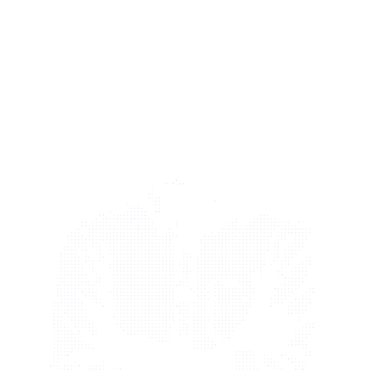

<div align="center">

```ascii
    ╔══════════════════════════════════════════════════════════════════════════════╗
    ║                                                                              ║
    ║               ██████╗  █████╗ ████████╗██╗   ██╗██╗                          ║
    ║               ██╔══██╗██╔══██╗╚══██╔══╝██║   ██║██║                          ║
    ║               ██████╔╝███████║   ██║   ██║   ██║██║                          ║
    ║               ██╔══██╗██╔══██║   ██║   ██║   ██║██║                          ║
    ║               ██║  ██║██║  ██║   ██║   ╚██████╔╝███████╗                     ║
    ║               ╚═╝  ╚═╝╚═╝  ╚═╝   ╚═╝    ╚═════╝ ╚══════╝                     ║
    ║                                                                              ║
    ║            Full Stack Developer × AI Engineer × Product Builder              ║
    ║                    Turning Coffee into Production Code                       ║
    ║                                                                              ║
    ╚══════════════════════════════════════════════════════════════════════════════╝
```

[](https://git.io/typing-svg)

<p align="center">
  
</p>

<p align="center">
  <a href="https://github.com/ratul-notfound"></a>&nbsp;&nbsp;
  <a href="https://linkedin.com/in/mahmud-hasan-ratul"></a>
  <br>
  <a href="mailto:m.h.ratul18@gmail.com"></a>&nbsp;&nbsp;
  <a href="https://github.com/ratul-notfound"></a>
</p>

<p align="center">
  
</p>

</div>

---

## 🎯 About Me

<div align="center">

```typescript
const ratul: Developer = {
  name: "Mahmud Hasan Ratul",
  role: "Full Stack Developer & AI Engineer",
  location: "Dhaka, Bangladesh 🇧🇩",
  education: "CSE @ Daffodil International University",
  languages: ["JavaScript", "TypeScript", "Python", "SQL"],
  focus: ["AI/ML Integration", "Scalable Systems", "Product Development"],
  
  currentWork: {
    building: ["AI-powered SaaS applications", "Production-ready systems"],
    learning: ["System Design", "Cloud Architecture", "ML Engineering"],
    contributing: "Open Source Projects"
  },
  
  available: true  // 🟢 Open for Opportunities
};

export default ratul;
```

</div>

---

## 📊 GitHub Statistics
<div align="center">
<a href="https://github.com/Ratul-NotFound"></a>&nbsp;<a href="https://github.com/Ratul-NotFound"></a>
<br>
<a href="https://github.com/Ratul-NotFound"></a>
<br>

</div>

---

## ⚡ Current Focus & Workflow

<div align="center">

```yaml
# 🎯 Active Focus & Specialization
frontend: "Next.js 14/15, React 19, Tailwind CSS, TypeScript"
backend:  "Node.js, Express, Supabase, Firebase, PostgreSQL"
ai_ml:    "Gemini 1.5/2.0 API, OpenAI GPT, Whisper, Agentic AI"
status:   "🟢 Active & Available for Full-Time Roles / Freelance"
mindset:  "🚀 Ship Fast • Iterate Faster • Scalable Architecture"
```

</div>

---

## 🚀 Featured Projects

<div align="center">

| Project | Description | Tech Stack | Links |
|:---|:---|:---|:---|
| **🤖 CV Maker AI** | AI-powered resume builder with ATS scoring and real-time PDF export. | Next.js, JavaScript, AI, PDF-lib | [Repo](https://github.com/Ratul-NotFound/CV-Maker-Ai) • [Live](https://cv-maker-ai-three.vercel.app) |
| **🎓 Lecture AI Pro** | Lecture transcription & AI note generator for students and teams. | Next.js, OpenAI Whisper, Gemini | [Repo](https://github.com/Ratul-NotFound/lecture-ai-pro) • [Live](https://lecture-ai-self.vercel.app) |
| **🧠 NeuroStack** | Real-time neural data visualization & intelligent developer toolkit. | React, TypeScript, Node.js | [Repo](https://github.com/Ratul-NotFound/NeuroStack) • [Live](https://nuro-stack.vercel.app) |
| **🌐 UniVibe** | Campus community social platform with real-time networking. | TypeScript, React, Firebase | [Repo](https://github.com/Ratul-NotFound/UniVibe) • [Live](https://neurostackv1.vercel.app/) |
| **🎨 ArtVince Academy** | Interactive e-learning platform for creative arts and workshops. | Next.js, TypeScript, Tailwind | [Repo](https://github.com/Ratul-NotFound/ArtVince-Academy-2) • [Live](https://art-vince-academy.vercel.app) |
| **💾 OrivoNAS** | Cloud-based personal NAS platform for secure file storage & sharing. | Node.js, Express, MongoDB | [Repo](https://github.com/Ratul-NotFound/OrivoNAS) |

</div>

<details>
<summary><b>📦 Expand Detailed Project Breakdown</b></summary>

<br>

<div align="center">

```yaml
Project: CV Maker AI
Role: Creator & Lead Developer
Features: [AI ATS Optimization, Real-time PDF Export, Smart Suggestions, Analytics]
Stack: [Next.js 14, Google Gemini API, PDF-lib, Tailwind CSS, Vercel]

Project: Orivo E-Commerce
Role: Full Stack Developer
Features: [Advanced Inventory, Stripe Payments, Real-time Dashboard, Order Tracking]
Stack: [Next.js 14, Firebase, Tailwind CSS, Shadcn/ui, Stripe API]

Project: BloodNet
Role: Mobile & Backend Engineer
Features: [GPS Donor Matching, Real-time Emergency Alerts, Community Network]
Stack: [React Native, Firebase Realtime DB, Google Maps API, Push Notifications]
```

</div>

</details>

---

## 🛠️ Tech Arsenal

<div align="center">

**🌐 Languages & Frontend**
<br>


<br><br>

**⚙️ Backend, Cloud & Databases**
<br>


<br><br>

**🤖 AI Engineering & Tools**
<br>


</div>

---

## 📈 Coding Activity

<div align="center">

<!--START_SECTION:waka-->
<!--END_SECTION:waka-->

</div>

---

<div align="center">

```ascii
╔═══════════════════════════════════════════════════════════════════╗
║                                                                   ║
║                      OPEN FOR OPPORTUNITIES                       ║
║                                                                   ║
║   Full-Time Roles  •  Freelance Projects  •  Collaborations       ║
║                                                                   ║
╠═══════════════════════════════════════════════════════════════════╣
║                                                                   ║
║   📍 Location: Dhaka, Bangladesh 🇧🇩                              ║
║   🕐 Timezone: Asia/Dhaka (GMT+6)                                ║
║   ⚡ Response Time: < 24 hours                                   ║
║   💬 Preferred: Email or LinkedIn                                ║
║   🟢 Status: Available Now                                       ║
║                                                                   ║
╚═══════════════════════════════════════════════════════════════════╝
```

<br>

[](mailto:m.h.ratul18@gmail.com)
[](https://linkedin.com/in/mahmud-hasan-ratul)
[](https://github.com/ratul-notfound)

</div>

---

<div align="center">

### 💬 Random Dev Quote


### 🐍 Contribution Graph


<br>

```javascript
// Thank you for visiting! 💙
console.log("Let's build something amazing together! 🚀");
```

**Built with 💙 by Ratul** • **Powered by ☕ & countless hours of debugging**


</div>
